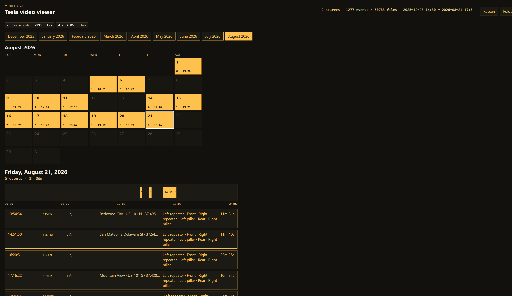
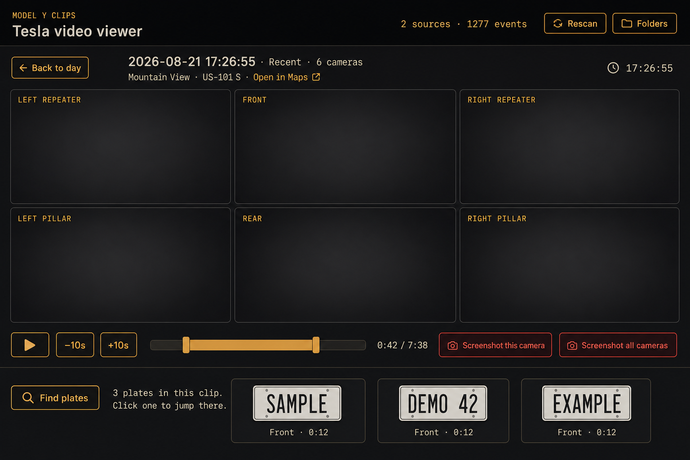
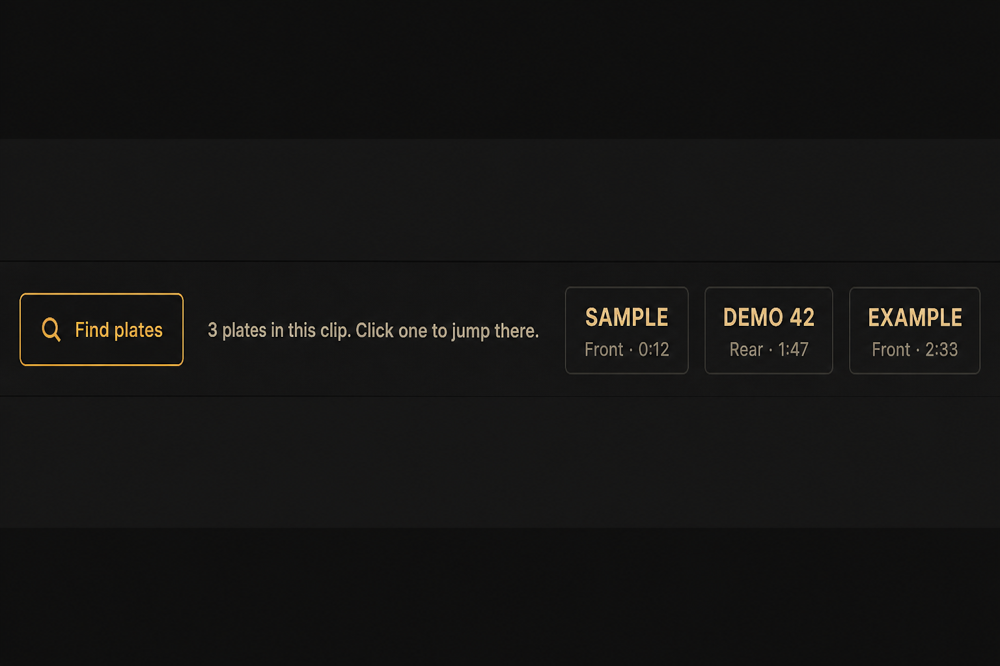

# Tesla video viewer

[](https://github.com/ernop/tesla-video-viewer/actions/workflows/ci.yml)

Local web app for TeslaCam footage already on this machine. Point it at one
or more folders, browse by day, and play every camera on one clock. It does
not talk to Tesla servers and it does not move the MP4s.

Built around a 2023 Model Y six-camera layout. Other TeslaCam dumps with the
same file names work too.

## UI

**Calendar.** Months with clips are listed. Amber days have footage; dark days
are empty. Each amber cell shows how many events that day starts with.



Pick a day and you get a 24-hour rail plus a list: time, Saved / Sentry /
Recent, which disk, place if we could read it, which cameras exist, duration.

**Player.** All cameras share one scrubber. Click a camera to enlarge it.
Screenshots write full-resolution PNGs. Place (city, street, map pin) sits
above the grid when the clip has it.



**Plates.** Opening a clip can queue a FastALPR scan of the **front**
camera (1 fps). Hits show up as cards under **Find plates**. Click a card
to jump the clock there. Header **Plates** is the catalog of every stored
plate. The screenshot below uses dummy labels only — real scans stay on
your machine.



## Features

- **Several sources at once.** USB TeslaCam, a folder dump, another disk.
  A missing drive stays listed and drops out of the scan until you plug it
  in and rescan.
- **Saved, Sentry, and Recent.** Folder layout plus `event.json` decide the
  kind. Recent clips are grouped when their timestamps are adjacent.
- **One clock for every camera.** Tesla writes ~1 minute files that often
  overlap or have a few seconds of gap. Playback hands off at the next
  stamp and keeps the last frame up while the next file loads.
- **Place.** Saved/Sentry pins from `event.json` (city, street, coarse lat/lon).
  Newer driving clips also have city/street in MP4 tags, and firmware
  2025.44.25+ can embed GPS in the video. Recent clips get a pin from that
  GPS when there is no sidecar.
- **Plates.** FastALPR on the front camera at 1 fps. Results live in
  `clip-index.sqlite3`. Click a plate, use scrubber marks, or open the
  catalog / car page from the header.
- **Stills.** Screenshot this camera, or all cameras, at the current time.
  Files land in `output_dir/<event-start>/`.
- **Incremental index.** SQLite next to `config.json`. Restart loads it at
  once. A later scan only re-reads files whose size or mtime changed.

Keyboard in the player:

| Key | Action |
| --- | --- |
| Space | Play / pause |
| Left / Right | Skip 10 seconds (Ctrl: 1 minute) |
| s | Screenshot the focused camera |
| Shift+S | Screenshot every camera |
| Esc | Leave focus, then back to the day |

## Tesla files

One MP4 per camera per minute. Names look like:

`2023-08-21_15-30-45-front.mp4`

Cameras: `front`, `back` (sometimes `rear`), `left_repeater`,
`right_repeater`, `left_pillar`, `right_pillar`.

On the USB stick:

| Folder | What it is |
| --- | --- |
| `TeslaCam/RecentClips/` | Rolling driving buffer. No `event.json`. |
| `TeslaCam/SavedClips/<stamp>/` | Dashcam / honk save. Has `event.json`. |
| `TeslaCam/SentryClips/<stamp>/` | Sentry trigger. Same sidecar. |
| `TeslaCam/EncryptedClips/` | Same layout, encrypted. This app skips those files. |

## Run

Python 3.13+, ffmpeg, and ffprobe. Plate scans run on **CPU** on this
install (DirectML crashes the FastALPR models here).

```powershell
cd C:\proj\tesla-video-viewer
python -m venv .venv
.\.venv\Scripts\Activate.ps1
pip install -r requirements.txt
copy config.example.json config.json
```

Edit `config.json`:

- `sources` — TeslaCam folders, USB drives, or clip dumps
- `output_dir` — folder for PNG dumps

```powershell
python -m app
```

Open http://127.0.0.1:8765/ and add folders in **Folders**. You can also
pass sources on the command line:

```powershell
python -m app --source C:\tesla-video --source D:\TeslaCam --output-dir C:\proj\tesla-video-viewer\screenshots
```

Save and scan returns immediately. A status line shows files while the walk
runs. If the walk stops early, already written rows stay in SQLite.

## Tests

```powershell
python -m pytest
```

Playback stitch tests need Node (CI installs it). They replay a real Recent
event’s timestamps so a freeze at 1:01 fails the build.

## Not in scope

- Decrypting `EncryptedClips`
- Uploading clips or calling Tesla’s fleet APIs
- Editing or deleting footage on the USB drive
- A live moving map (GPS is a single pin today)
